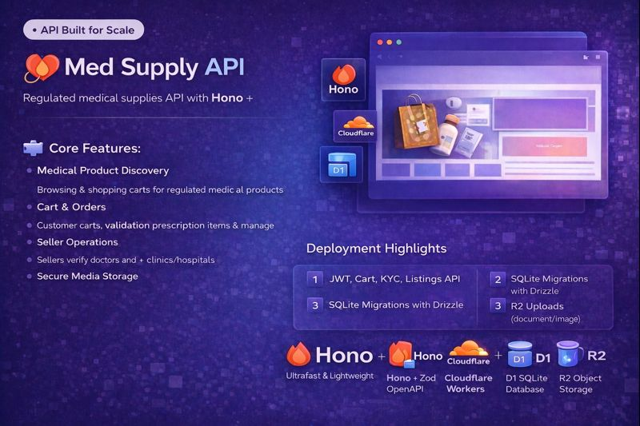

# 🩺 Med Supply API

## 🚧 Status: Actively in Development

Med Supply API is the backend service for a regulated medical supplies marketplace, handling product management, seller onboarding, carts, orders, and secure media handling.

This project is currently ~50–60% complete and actively being built. Core APIs and architecture are in place, with additional features and refinements underway.

## 🧩 Project Overview

The API powers a full-stack medical marketplace with support for:

Product & category management

Seller onboarding workflows

Cart and order processing

Secure file/media handling

Role-based access (admin / seller / customer)

Built with a focus on scalability, clean architecture, and edge performance.

## 🛠 Tech Stack

Runtime: Cloudflare Workers

Framework: Hono

Database: Cloudflare D1 / SQL

Storage: Cloudflare R2

Auth: JWT-based authentication

Validation: Zod

ORM / Queries: Drizzle / SQL

## ✨ Features (Current & Planned)
### ✅ Implemented / In Progress

Product & category APIs

Seller onboarding structure

Cart & order schema

Secure API routing

Environment-based configuration

### 🔜 Planned

Order lifecycle management

Seller KYC flow

Admin moderation APIs

Analytics & reporting endpoints

API rate limiting & security hardening

## 📸 Screenshots

### 🚧 Coming Soon
Screenshots will be added once core flows are finalized.

## 🎥 Demo Video

### 🚧 Coming Soon
A walkthrough demo will be recorded after completing MVP features.

🔗 Related Repository

Frontend application:
🔗 [Med Supply Frontend](https://github.com/asad2050/med-supply-frontend)
